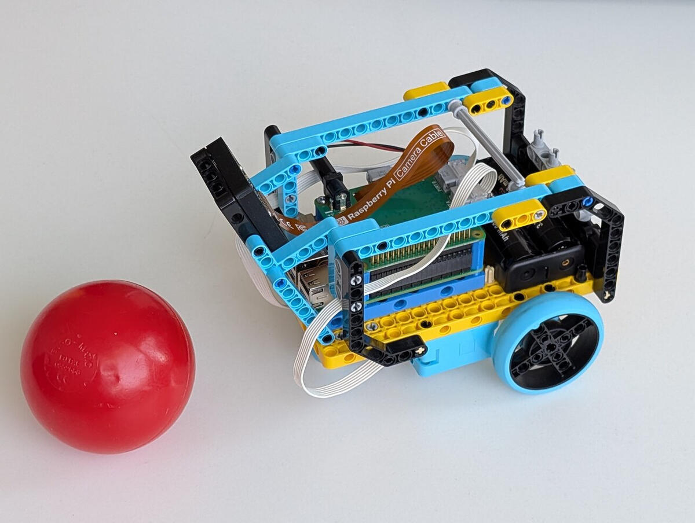

# tuw_spike

ROS 2 packages for **tuw_spike**, a small differential-drive research robot
built from LEGO SPIKE / Build HAT motors on a Raspberry Pi, with a
Raspberry Pi camera used both for image capture and for camera-based
localization.

Motor control is exposed through a
[`ros2_control`](https://control.ros.org/) hardware interface
(`tuw_spike_control`). The Build HAT is driven from that interface over a
**direct serial link implemented in C++ with
[Boost.Asio](https://www.boost.org/doc/libs/release/doc/html/boost_asio.html)**,
talking the HAT's ASCII UART protocol directly — the packages deliberately do
*not* use the Python
[`buildhat`](https://buildhat.readthedocs.io/) library provided by Raspberry Pi.



## Packages

| Package | Description |
|---|---|
| [`tuw_spike_control`](tuw_spike_control/) | `ros2_control` hardware interface and control nodes for the drive motors, driven through a [Raspberry Pi Build HAT](https://www.raspberrypi.com/products/build-hat/) over UART. |
| [`tuw_spike_description`](tuw_spike_description/) | URDF/xacro model of the robot and its `robot_state_publisher` launch. |
| [`tuw_spike_simulation`](tuw_spike_simulation/) | Gazebo world and robot-spawning launch files for simulating tuw_spike. |
| [`tuw_libcamera`](tuw_libcamera/) | ROS 2 composable nodes for capturing images from a [libcamera](https://libcamera.org/)-supported camera and republishing them through `image_transport`. |
| [`tuw_camera_laserscan`](tuw_camera_laserscan/) | Ray-based localizer that uses the camera image against a known map (AMCL-style bring-up included). |

See each package's own `README.md` (where present) for build and launch
details.

## License

All packages are released under the BSD 3-Clause License — see [`LICENSE`](LICENSE)
(a copy is included in every package).

## Acknowledgements

This package started from a student bachelor's thesis project at the
[Automation Systems (E191-03)](https://auto.tuwien.ac.at/auto/) research unit
of the [Institute of Computer Engineering](https://ti.tuwien.ac.at/), [TU Wien](https://www.tuwien.at/en/).
Many thanks to the original creators for building it and making it available:

- **Jakob Buchsteiner**
- **Daniel Marth**
- **Moritz Taferner**

Upstream repository: <https://github.com/tuw-robotics/tuw_spike>

## Citation

If you use this work in a publication, please cite:

> J. Buchsteiner, D. Marth, M. Taferner, and M. Bader, "ROS with LEGO Spike,"
> *ARW Proceedings* (Proceedings of the Austrian Robotics Workshop 2025),
> vol. 25, no. 1, pp. 117–118, 2025. doi:
> [10.34749/3061-0710.2025.20](https://doi.org/10.34749/3061-0710.2025.20).
> <https://arw-proceedings.acin.tuwien.ac.at/article/id/734/>

```bibtex
@article{Buchsteiner2025,
  author  = {Buchsteiner, Jakob and Marth, Daniel and Taferner, Moritz and Bader, Markus},
  title   = {ROS with LEGO Spike},
  journal = {ARW Proceedings},
  volume  = {25},
  number  = {1},
  pages   = {117--118},
  year    = {2025},
  doi     = {10.34749/3061-0710.2025.20}
}
```
