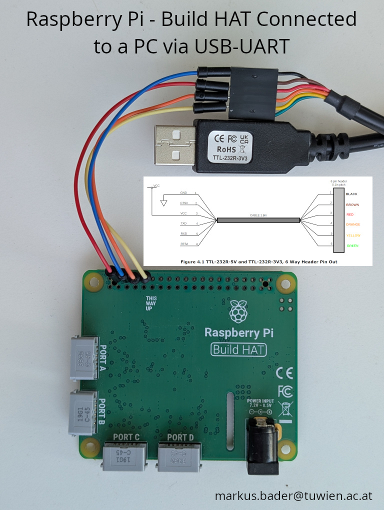

# tuw_spike_control

`ros2_control` hardware interface and control nodes for TuwSpike's drive
motors, which are LEGO SPIKE / Build HAT motors driven through a
[Raspberry Pi Build HAT](https://www.raspberrypi.com/products/build-hat/).



> **Note:** if the Build HAT is powered via its own **Power Input** (e.g. a
> battery pack for the motors), disconnect the USB/UART power feed to the
> HAT — do not power it from both sources at the same time.

## Motor control via UART

The Build HAT itself is not a ROS node — it is a small microcontroller board
that sits on top of the Raspberry Pi and exposes a line-based ASCII protocol
over **UART** (`/dev/ttyAMA0`, 115200 baud). `TuwSpikeSystemInterface`
([`src/tuw_spike_control_interface.cpp`](src/tuw_spike_control_interface.cpp))
talks to it directly via `boost::asio::serial_port`:

- **`on_configure()`** opens the serial port, checks the HAT's firmware
  version and, if needed, uploads the firmware/signature pair from
  [`firmware/`](firmware/) and reboots the HAT. It then arms each motor port
  with a `pid_diff` velocity controller (`plimit`, `combi`, `select`,
  `selrate`, `pid_diff` commands).
- **`write()`** converts the commanded wheel velocities (rad/s) into `port
  <n>; set <value>;` commands and writes them to the serial port.
- **`read()`** parses the HAT's periodic `P<n>C0: ...` status lines to update
  motor position and velocity feedback.
- **`on_cleanup()`/`on_deactivate()`** stop both motors and close the serial
  port.

Each wheel joint's Build HAT port number is read from its URDF `hardware_interface` mapping via the `Port` parameter (see [`hardware_interface.xml`](hardware_interface.xml)).

> **Note:** the device name for the HAT's UART depends on the platform it is
> connected to:
> - Raspberry Pi running Ubuntu: `/dev/ttyAMA0`
> - PC (via a USB-serial adapter): `/dev/ttyUSB0`
> - Raspberry Pi running Raspberry Pi OS: `/dev/serial0`
>
> **Note:** when running in a container on a PC, the USB-serial adapter must
> already be plugged in before the container is started, so the device is
> present to be passed through into the container.

## Launching

Bring up `ros2_control` with the diff-drive controller against the real hardware:

```bash
ros2 launch tuw_spike_control hardware.launch.py
```

### Demo

[`launch/demo.launch.py`](launch/demo.launch.py) starts the same
`ros2_control_node` + `controller_diff_drive` spawner, plus robot state
publishing, and accepts a `controllers_config` argument to select an
alternate controller parameter file from [`config/`](config/):

```bash
ros2 launch tuw_spike_control demo.launch.py
```

There is also a minimal standalone C++ demo,
[`src/demo.cpp`](src/demo.cpp) (executable `demo`), which instantiates
`TuwSpikeSystemInterface` directly — without `ros2_control_node` or a
controller — and spins both wheels at 2 rad/s for a few seconds to exercise
the hardware interface end-to-end:

```bash
ros2 run tuw_spike_control demo
```
